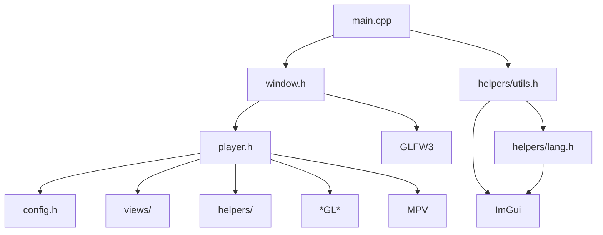

# 开发计划

1. 将 ImPlay 中 `window.cpp` 中相关的代码抽离出来，实现一个最简易窗口
2. 将 ImGui 相关的代码抽离到 `imgui.cpp` 中，整理到 `namespace sakura::imgui` 中
3. 将 `window.cpp` 中剩余代码整理到 `namespace sakura::ui` 中
4. 基于 `window.cpp` 构建 `player.cpp`

# Implay Dependencies

