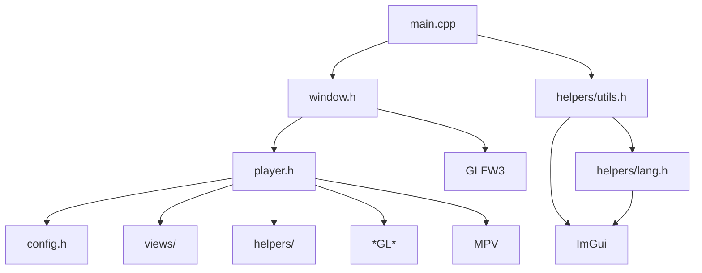

# 开发计划

1. 将 ImPlay 中 `window.cpp` 中相关的代码抽离出来，实现一个最简易窗口
2. 将 ImGui 相关的代码抽离到 `imgui.cpp` 中，整理到 `namespace sakura::imgui` 中
3. 将 `window.cpp` 中剩余代码整理到 `namespace sakura::ui` 中
4. 基于 `window.cpp` 构建 `player.cpp`
5. (*) 封装 event loop
6. 拆分出一个 `imgui-bootstrap` 项目

# Implay Dependencies

## 优化

- [ ] (chore) add `.clang-tidy`
- [ ] (docs) add Doxygen or Adobe Hyde configuration

## 界面设计

- 基础媒体控制
- 视频轨 select
- 音频轨 select
- 主字幕 select
- 副字幕 select
- 倍速 slider，搭配倍速 select，后期考虑（通过配置文件）自定义倍速档位
- 文件标题，搭配媒体信息 button（基于 mediainfo？），搭配文件选取 button（暂定位于顶部）
- (*) 调试界面
- (*) 命令菜单，基于 [imgui-command-palette](https://github.com/hnOsmium0001/imgui-command-palette)

## 快捷键设计

- 播放/暂停：Space, LeftClick
- 全屏切换：Alt + Enter, LeftDoubleClick
- 菜单：RightClick
- 跳转：Left/Right
- 音量调节：Up/Down, mouse wheel
- 小跳转：Shift + Left/Right
- 大跳转：Ctrl + Left/Right
- 帧步进/步退：Alt + Left/Right
- 倍速调节（按间隔）：Shift + Up/Down
- 倍速调节（按档位）：Ctrl + Up/Down
- 重置倍速：Backspace
- 播放上/下一个：PageUp/PageDown
- (*) 命令菜单：F1
